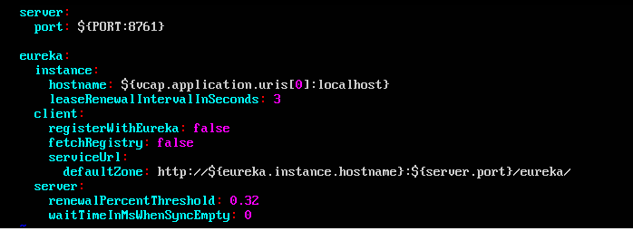

# Unit 1: Working with Operation Framework #

In this example, the Netflix OSS implementation of Eureka and Zuul are performed in IBM Containers. Eureka provides the Service Registry and Service Discovery capabilities and Zuul provides the Service Proxy and Load Balancing capabilities.  

## Exercise 1: Deploying Eureka for BlueCompute

The steps in this exercise are acquired from `https://github.com/ibm-cloud-architecture/refarch-cloudnative-netflix-eureka`. While it is faster to use the provided scripts to deploy the component, you will use individual commands to deploy the component in order to make you aware of the actual process to deploy it.  

<ol>
<li> Explore the eureka application. The application settings are stored in `src/main/resources/application.yml` file. </li>
<ul>
<li><em>cd refarch-cloudnative-netflix-eureka</li>
<li> vi src/main/resources/application.yml</em></li>
</ul>

For a spring application, the contents of the  application.yml file represents environment variables that can be configured when it is invoked. 
These values can be overridden at execution time, which is what you will be doing when the Container group is created. 
The separation of the configuration and code is in-line with 12 factor apps (Factor #3 Config).

<li>Build the eureka jar file. There is an option to use Maven or Gradle. In this exercise, you use Gradle as some other components do not have the maven configuration. The build result will be at `build/libs/eureka-0.0.1-SNAPSHOT.jar`, once the processing ends, check that the file exists.</li>
<ul>
<li><em>./gradlew clean build</em>
</ul>
<li>Use the generated JAR file to run the Java application. The application will run in a docker container. The process is to build the container locally and then upload that to Bluemix. Docker building is based on the Dockerfile commands. Take a look at this file first.</li>
<ul>
<li><em>cd docker</em> </li>
<li><em>vi Dockerfile</em> </li>

In the Dockerfile, the container is built as follows:
<ul>
<li>From the standard java container from DockerHub. </li>
<li>Adding a /tmp filesystem</li>
<li>Add app.jar (you will create this app.jar from the build result later)</li>
<li>Expose port 8761</li>
<li>Define an main process for the container (which is running the Spring application) </li>
</ul>
<li>Copy the jar file and build docker container locally for eureka
<ul>
<li><em>cp ../build/libs/eureka-0.0.1-SNAPSHOT.jar app.jar</em></li>
<li><em>docker build -t netflix-eureka . </em></li>
</ul>
<li>Deploy eureka as IBM Container. You will use an environment variable called SUFFIX; this is to make your instances unique for the class. If you follow the README.md guide, this suffix is your container namespace string. Note that the group create command defines environment variables that represent the entries in the application.yml that you looked at earlier.
<ul>
<li><em>export SUFFIX=<your suffix></em></li>
<li><em>docker tag netflix-eureka registry.ng.bluemix.net/$(cf ic namespace get)/netflix-eureka-${SUFFIX}</em></li>
<li><em>docker push registry.ng.bluemix.net/$(cf ic namespace get)/netflix-eureka-${SUFFIX}</em></li>
<li><em>cf ic group create --name eureka_cluster --publish 8761 --memory 256 --auto \
          --min 1 --max 3 --desired 1 \
          --hostname netflix-eureka-${SUFFIX} \
          --domain mybluemix.net \
          --env eureka.client.fetchRegistry=true \
          --env eureka.client.registerWithEureka=true \
          --env eureka.client.serviceUrl.defaultZone=http://netflix-eureka-${SUFFIX}.mybluemix.net/eureka/ \
          --env eureka.instance.hostname=netflix-eureka-${SUFFIX}.mybluemix.net \
          --env eureka.instance.nonSecurePort=80 \
          --env eureka.port=80 \
           registry.ng.bluemix.net/$(cf ic namespace get)/netflix-eureka-${SUFFIX}</em> </li>
</ul>
<li> Wait a while to let the container initialize, and then verify eureka:

   - Open a Web browser and connect to http://netflix-eureka-${SUFFIX}.mybluemix.net
   - The Eureka interface is shown below with only itself registered as a component

Now that Eureka is deployed, other components that uses the OSS can be deployed. Next step is to deploy the service proxy, Zuul. 

