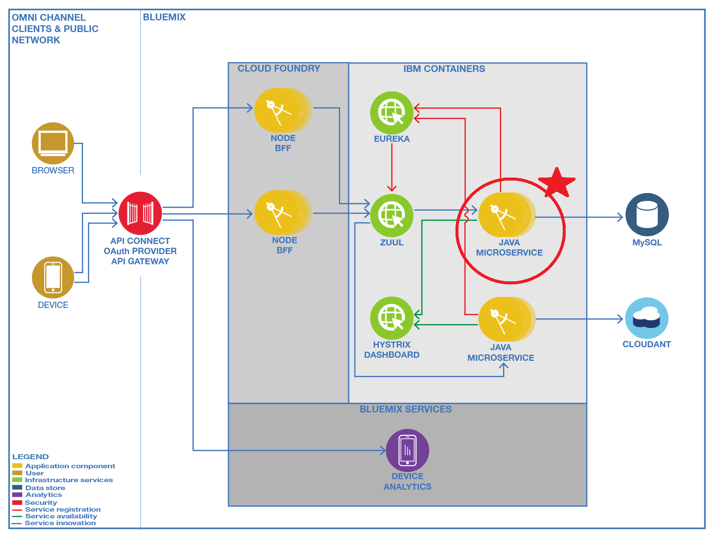
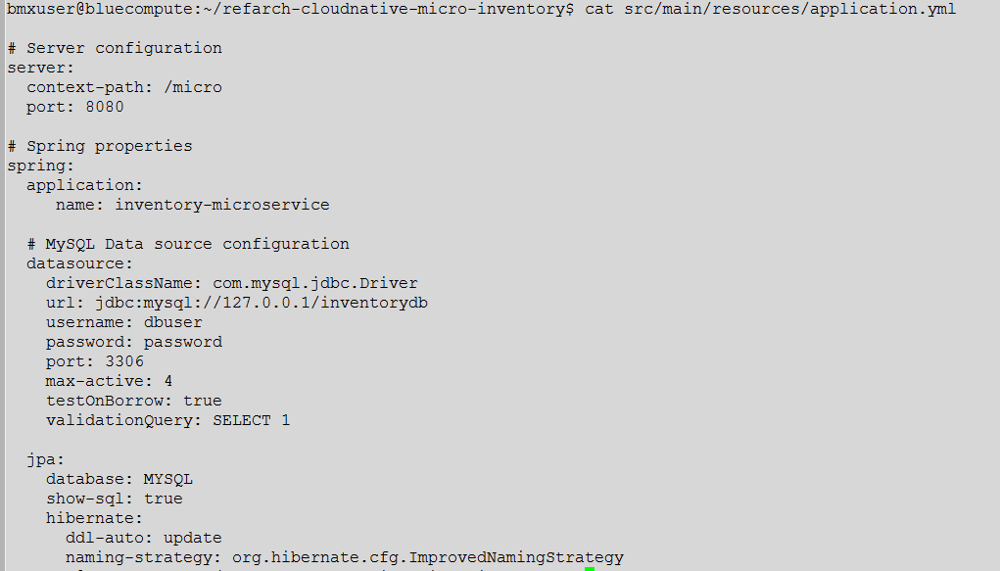
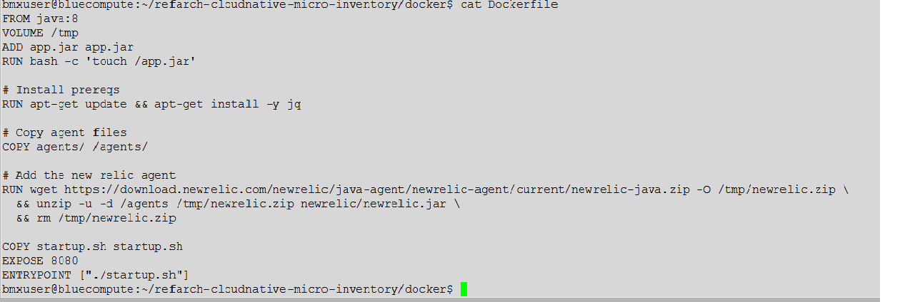
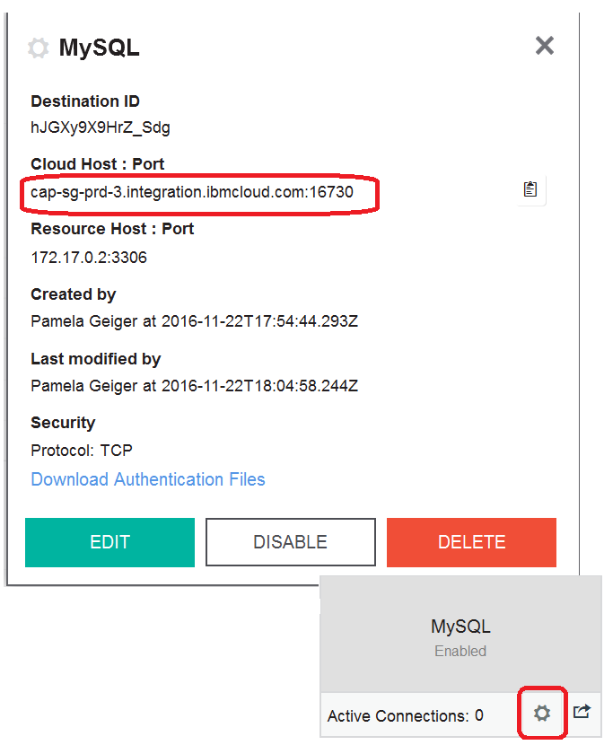
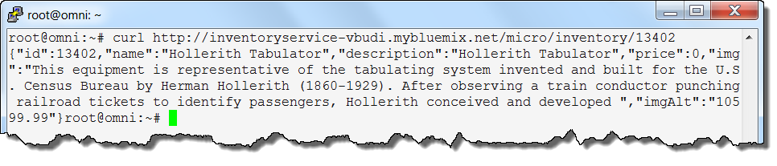
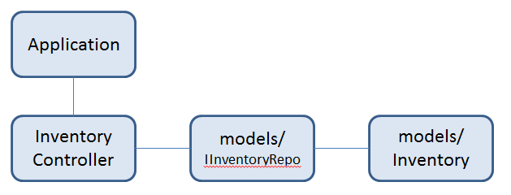
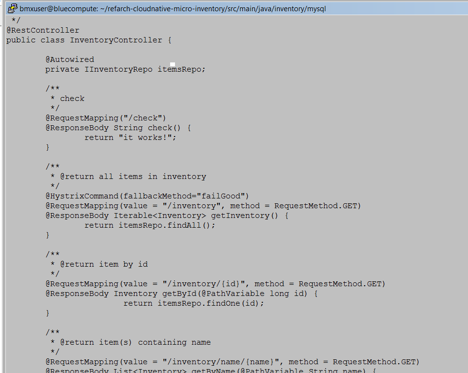
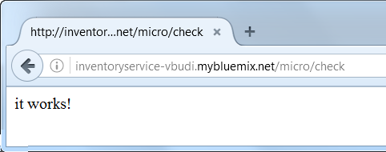

# Deploying the Inventory microservice

In this exercise you will be deploying an inventory application. Because you are creating a cloud native application from scratch, the decision was made to create a microservices based application. The inventory application will be using an SQL database to store, retrieve, and update the inventory application.

<em>Expected outcome:</em> You have the inventory microservice running in a Bluemix container and comminicating with an on-premise mySQL database through a secure gateway connection. Success is measured by successfully using the application to query the database.

The application code is provided as part of this exercise, but let's take some time to examine the application.  

## Exercise 1: Deploying the Inventory microservice
The inventory microservice is based on the Spring framework and runs in an IBM Container. The instructions here are based on `https://github.com/ibm-cloud-architecture/refarch-cloudnative-micro-inventory/README.md`.

The Spring Framework is an open source application framework that is intended to make JEE development easier. The Spring Framework grew out of developer experience using JEE without frameworks, or with a mix of in-house frameworks. Spring offers services for use throughout an application, not merely in a single architectural tier. Spring aims to take away much of the pain resulting from the complexity and common problems typically encountered in creating JEE applications.

1. Explore the application. If you didn't run clonePeers previously, you first need to get the code. From your home directory, run the following command:

        # git clone https://github.com/pfgeiger/refarch-cloudnative-micro-inventory.git
First look at the configuration file, `src/main/resources/application.yml`. As in any Spring framework based application, this is where the configuration is stored.

         # cd refarch-cloudnative-micro-inventory
         # vi src/main/resources/application.yml

 
 The important configuration options are:

   - server.context-path        
   - spring.datasource.url
   - spring.datasource.username
   - spring.datasource.password

 The datasource options will be overriden with your database information when the container is started.

2. Build the application.

         # cd refarch-cloudnative-micro-inventory
         # ./gradlew build

    When the build completes, the build result is in `build/libs/micro-inventory-0.0.1.jar`. This is the file that is used by the microservice.

3. Look at the Dockerfile.

        # cat docker/Dockerfile

 
 The Dockerfile defines how the docker image is built. In this case, the container is built as follows:

  - From the standard java container from DockerHub
  - Adding a /tmp filesystem
  - Add app.jar (This is the jar file for the inventory app that you built in the previous step.
  - Installing the New Reic agent. This is a java performance monitoring agent that has little overhead
  - Expose port 8080 - Define a main process for the container (which is running the Spring application)

4. Build the docker image. The first step is copying the jar file that you built to the app.jar file that the Dockerfile is looking for.

       		 # cp build/libs/micro-inventory-0.0.1.jar docker/app.jar
      	 	 # cd docker
      	      # docker build -t cloudnative/inventoryservice .

5. You will use an environment variable called SUFFIX; this is to make your instances unique for the class. If you follow the README.md guide, this suffix is your container namespace string. Note that the group create command defines environment variables that represent the entries in the application.yml that you looked at earlier.

        # export SUFFIX=<your suffix>

6. Tag and push the local docker image to bluemix private registry.

        # docker tag cloudnative/inventoryservice registry.ng.bluemix.net/$(cf ic namespace get)/inventoryservice-${SUFFIX}
        # docker push registry.ng.bluemix.net/$(cf ic namespace get)/inventoryservice-${SUFFIX}

7. Retrieve the cloud destination that you configured for the mysql database destination in the Bluemix Secure Gateway service.
  - Open the Bluemix user interface at console.ng.bluemix.net
  - Login with your Bluemix credentials
  - Click the Secure-Gateway service in the Services Section
  - Click BackendGateway Settings
  - Make a note of the cloud host and port. You will need it in the next step

 

7. Start the application in an IBM Bluemix container. Replace  ` <cloud destination>` with the cloud host and port from the previous step.  

        # cf ic group create -p 8080 -m 256 --min 1 --desired 1 \
         --auto --name micro-inventory-group-${SUFFIX} \
	       -e "spring.datasource.url=jdbc:mysql://**<cloud destination>**/inventorydb" \
         -e "spring.datasource.username=dbuser" \
         -e "spring.datasource.password=Pass4dbUs3R" \
         -n inventoryservice-${SUFFIX} -d mybluemix.net \
         registry.ng.bluemix.net/$(cf ic namespace get)/inventoryservice-${SUFFIX}

 With this command, you are creating and starting a container group in Bluemix with the following characteristics:
  - p: uses port 8080
  - m: container memory limit is 256M
  - min: there is a minimum of 1 instance in the group
  - desired: the desired number of instances is 1
  - auto: auto recovery is enabled

 The -e tags are setting environment variables for the inventory application. The containers will have access to these environment variables which the inventory application will use to access the database. These values override what was defined in the application.yml file as follows:
  - The datasorce url is the url for the mysql inventory database that is running on-premise and is accessed through the Secure-Gateway service.
  - the datasource username is the user name that is defined for the database
  - datsource password is the password for the datasource user

7. Validate the inventory service.

        # curl http://inventoryservice-${SUFFIX}.mybluemix.net/micro/inventory/13402

## Exercise 2: Understanding a Spring framework Java program

1. Look at the Java program that uses the Spring framework. The source is located under src/main/java. The application uses a Java package that is named inventory.mysql and has a structure similar to:

   - Application: the main program that loads spring
   - InventoryController: the logic for URL mappings
   - models/IInventoryRepo: uses CrudController that allows encapsulation of data into an API
   - models/Inventory: class that is used to map individual data item's fields
2. The main logic that controls the API is provided in InventoryController.java.

   The interface is quite simple. Based on the prefix in the application.yml (`/micro`) and the @RequestMapping directive, you can see that
`http://inventoryservice-${SUFFIX}.mybluemix.net/micro/check` will return **`It works!`** as its reply.

# References:
http://www.wrox.com/WileyCDA/Section/Why-Use-the-Spring-Framework-.id-130098.html
http://heidloff.net/article/17.08.2015084655NHE9YE.htm This is a handy cheatsheet for working with containers in IBM Bluemix
