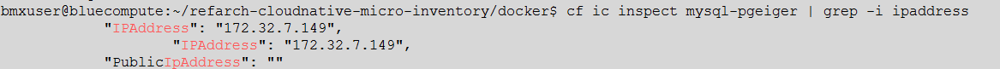

# Deploying the Inventory microservice 

In this exercise you will be deploying an inventory application. Because you are creating a cloud native application from scratch, the decision was made to create a microservices based application. The inventory application will be using an SQL database to store, retrieve, and update the inventory application.

<em>Expected outcome:</em> You have the inventory microservice running in a Bluemix container and comminicating with a Cloudant database. Success is measured by successfully using the application to query the database.
 

The application code is provided as part of this exercise, but let's take some time to examine the application.  

## Exercise 1: Deploying Inventory microservice
The inventory microservice is based on the Spring framework and runs in an IBM Container. The instructions here are based on `https://github.com/ibm-cloud-architecture/refarch-cloudnative-micro-inventory/README.md`. 

The Spring Framework is an open source application framework that is intended to make J2EE development easier. Unlike single-tier frameworks, Spring aims to help structure whole applications in a consistent, productive manner, pulling together best-of-breed single-tier frameworks to create a coherent architecture.
The Spring Framework grew out of developer experience using J2EE without frameworks, or with a mix of in-house frameworks. Spring offers services for use throughout an application, not merely in a single architectural tier. Spring aims to take away much of the pain resulting from the complexity and common problems typically encountered in creating J2EE applications. 

1. Explore the application. First look at the configuration file, `src/main/resources/application.yml`. As any Spring framework based application, this is where the configuration is stored.

        # cd refarch-cloudnative-micro-inventory
        # vi src/main/resources/application.yml

   The important configuration options are:
   - server.context-path        
   - spring.datasource.url
   - spring.datasource.username
   - spring.datasource.password
   
    The datasource options will be overriden with your database information when the container is started.

2. Build the application. When the build completes, the build result is in `build/libs/micro-inventory-0.0.1.jar`. This is the file that is used by the microservice. 

        # cd refarch-cloudnative-micro-inventory
        # ./gradlew build

3. Look at the Dockerfile.
 
        # cat docker/Dockerfile

   The Dockerfile defines how the docker image is built. In this case, the container is built as follows:
<ul>
<li>From the standard java container from DockerHub. </li>
<li>Adding a /tmp filesystem</li>
<li>Add app.jar (This is the jar file for the inventory app that you built in the previous step.)</li>
<li>Instlling the New Relic agent. This is a java performance monitoring agent that has little overhead.  
<li>Expose port 8080</li>
<li>Define a main process for the container (which is running the Spring application) </li>

4. Build the docker image. The first step is copying the jar file that you built to the app.jar file that the Dockerfile is looking for. 

        # cp build/libs/micro-inventory-0.0.1.jar docker/app.jar
        # cd docker
        # docker build -t cloudnative/inventoryservice . 

5. You will use an environment variable called SUFFIX; this is to make your instances unique for the class. If you follow the README.md guide, this suffix is your container namespace string. Note that the group create command defines environment variables that represent the entries in the application.yml that you looked at earlier.

        # export SUFFIX=<your suffix> 

Tag and push the local docker image to bluemix private registry.

        # docker tag cloudnative/inventoryservice registry.ng.bluemix.net/$(cf ic namespace get)/inventoryservice-${SUFFIX}
        # docker push registry.ng.bluemix.net/$(cf ic namespace get)/inventoryservice-${SUFFIX}

6. Get the private IP address of the database container.

        # cf ic inspect mysql-${SUFFIX} | grep -i ipaddress

    
7. Start the application in an IBM Bluemix container. Replace `{ipaddr}` with the private IP address of the database container that you retrieved in the previous step. 

        # cf ic group create -p 8080 -m 256 --min 1 --desired 1 \
         --auto --name micro-inventory-group-${SUFFIX} \
         -e \
"spring.datasource.url=jdbc:mysql://${ipaddr}:3306/inventorydb" \
         -e "spring.datasource.username=dbuser" \
         -e "spring.datasource.password=Pass4dbUs3R" \
         -n inventoryservice-${SUFFIX} -d mybluemix.net \
         registry.ng.bluemix.net/$(cf ic namespace get)/inventoryservice-${SUFFIX}

8. Validate the inventory service.

        # curl http://inventoryservice-${SUFFIX}.mybluemix.net/micro/inventory/13402

     
## Exercise 2: Understanding a Spring framework Java program

1. Look at the Java program that uses the Spring framework. The source is located under src/main/java. The application uses a Java package that is named inventory.mysql and has a structure similar to:

   - Application: the main program that loads spring
   - InventoryController: the logic for URL mappings
   - models/IInventoryRepo: uses CrudController that allows encapsulation of data into an API
   - models/Inventory: class that is used to map individual data item's fields
2. The main logic that controls the API is provided in InventoryController.java. 

   The interface is quite simple. Based on the prefix in the application.yml (`/micro`) and the @RequestMapping directive, you can see that 
`http://inventoryservice-${SUFFIX}.mybluemix.net/micro/check` will give `It works!` as its reply.
 

# References:
http://www.wrox.com/WileyCDA/Section/Why-Use-the-Spring-Framework-.id-130098.html