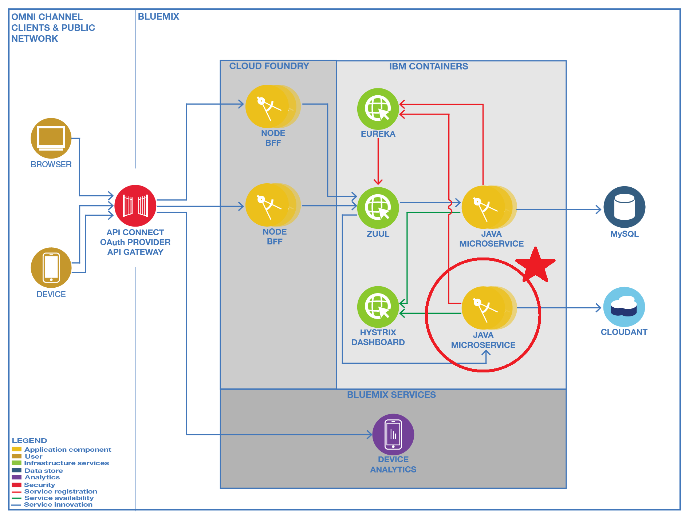
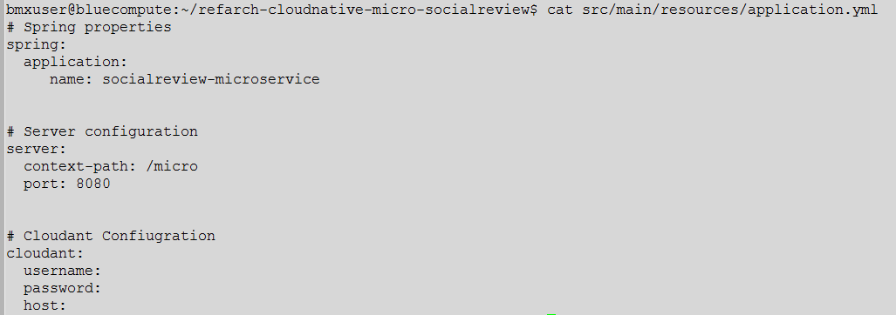

# Deploying the Social Review microservice 

This unit exercises walk you on installing the social review exercises. The social review microservice runs in a container and uses the Cloudant database that you created in an earlier exercise.

 
 

## Exercise 1: Building the Social Review microservice

This exercise builds the social review application. Like the inventory application, it uses the Spring framework. 

1. Look at the socialreview configuration in refarch-cloudnative-micro-socialreview/src/main/resources/application.yml

        # cd refarch-cloudnative-micro-socialreview
        # vi src/main/resources/application.yml

   The important parameters here are (you should be able to know what their values should be by now):

   - cloudant.username
   - cloudant.password 
   - cloudant.host

2. Build the application using Gradle. The result is stored in `build/libs/micro-soialreview-0.1.0.jar`. Note that the test step will try to run the application, which is not available locally.

        # ./gradlew build -x test

3. Copy the jar file and build docker container. You can look into the docker/Dockerfile. Its content is similar to the one from inventory microservice.

        # cp build/libs/micro-socialreview-0.1.0.jar docker/app.jar
        # cd docker
        # docker build -t cloudnative/socialreviewservice .

3. Load the socialreview microservice container to Bluemix; note that you again use the SUFFIX variable.

        # docker tag cloudnative/socialreviewservice registry.ng.bluemix.net/$(cf ic namespace get)/socialreviewservice-${SUFFIX}
        # docker push registry.ng.bluemix.net/$(cf ic namespace get)/socialreviewservice-${SUFFIX}

4. Run socialreview microservice as IBM Container group 

        # cf ic group create -p 8080 -m 256 \
          --min 1 --desired 1 --auto \
          --name micro-socialreview-group \
          -n socialreviewservice-${SUFFIX} \
          -d mybluemix.net \
          -e "cloudant.username=<uuid>-bluemix" \
          -e "cloudant.password=<password> " \
          -e "cloudant.host=https://<uuid>-bluemix.cloudant.com" \ 
          registry.ng.bluemix.net/$(cf ic namespace get)/socialreviewservice-${SUFFIX}

5. Check the result from a Web browser or `curl` command 

        curl http://socialreviewservice-<suffix>.mybluemix.net/micro/review/

 